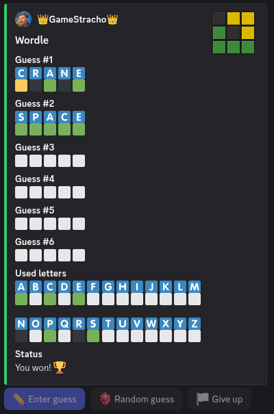
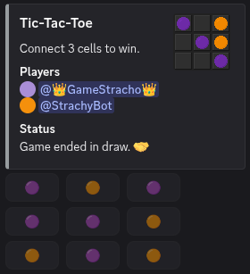
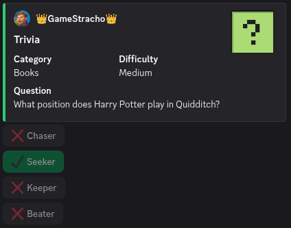
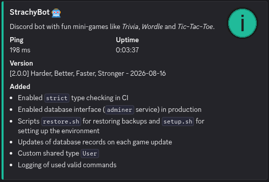

# 🤖 Discord Bot

[](https://www.python.org)
[](https://discordpy.readthedocs.io/)
[](https://www.docker.com)
[](https://www.postgresql.org)
[](https://hub.docker.com/r/dockette/adminer)
[](https://www.raspberrypi.com)
[](https://discord.com/oauth2/authorize?client_id=1024635572591001630&permissions=378880&integration_type=0&scope=bot+applications.commands)

## 📌 About
Discord bot with fun mini-games like *Trivia*, *Wordle* and *Tic-Tac-Toe* built with **Python** and **[discord.py](https://discordpy.readthedocs.io/en/stable/)**. 

## 🎮 Features & Commands

| Command | Description | Showcase |
|---|---|---|
| `/wordle` | Try to guess a 5-letter word in 6 tries. |  |
| `/tic-tac-toe @user` | Challenge someone in a 1v1 Tic-Tac-Toe match. |  |
| `/trivia` | Try to answer a quiz question by selecting 1 of 4 answers. |  |
| `/info` | Show important information about the bot. |  |

---

## 🛠️ Installation & Setup

### Option 1: Local Development
**Prerequisites**
 - Install [Python](https://www.python.org/downloads/)
 - Install [Docker](https://docs.docker.com/engine/install/)
 - Install [Docker Compose](https://docs.docker.com/compose/install/)

1. Clone the repository and navigate into it:
   ```bash
   git clone https://github.com/GameStracho/StrachyBot
   cd StrachyBot
   ```
2. Make the setup script executable and run the script.
   > Make sure to select `Development` mode during setup.
   ```bash
   chmod u+x scripts/setup.sh
   ./scripts/setup.sh
   ```
3. (Optional) *VS Code Configuration:* Ensure your python interpreter is set to the virtual environment. Press `Ctrl+Shift+P` (or `Cmd+Shift+P`), search for **Python: Select Interpreter**, and choose the one inside `./venv/bin/python`.
4. Run docker services (database and adminer).
   > Upon start you can access adminer (database interface) at *localhost:ADMINER_PORT* (*[localhost:8080](http://localhost:8080/)* by default)
   ```bash
    docker compose up --build

    # or start in detached (background) process
    docker compose up --build -d
    ```
5. Update database to latest migration.
   ```bash
   alembic upgrade head
   ```
6.  Run the bot locally.
    ```bash
    # Linux/macOS
    python3 src/main.py

    # Windows
    python src/main.py
    ```

### Option 2: Docker hosting (Recommended)
**Prerequisites**
 - Install [Docker](https://docs.docker.com/engine/install/)
 - Install [Docker Compose](https://docs.docker.com/compose/install/)

1. Clone the repository and navigate into it:
   ```bash
   git clone https://github.com/GameStracho/StrachyBot
   cd StrachyBot
   ```
2. Make the setup script executable and run the script.
   > Make sure to select `Production` mode during setup.
   ```bash
   chmod u+x scripts/setup.sh
   ./scripts/setup.sh
   ```
3. Build and start the bot via docker.
   > Upon start you can access adminer (database interface) at *localhost:ADMINER_PORT* (*[localhost:8080](http://localhost:8080/)* by default)
   ```bash
    docker compose up --build

    # or start in detached (background) process
    docker compose up --build -d
   ```

### Automatic database backups (optional)
1. Create a new **private** StrachyBotBackups repository on [GitHub](https://github.com/new)
2. Add SSH key to your [GitHub account](https://docs.github.com/en/authentication/connecting-to-github-with-ssh/adding-a-new-ssh-key-to-your-github-account)
3. Clone the StrachyBotBackups repository into `backups`
   ```bash
      git clone git@github.com:YOUR-GITHUB-USERNAME/StrachyBotBackups.git backups
   ```
4. Update backup script's privileges to make it executable
   ```bash
   chmod +x scripts/backup.sh
   ```
5. Open cron manager terminal.
   ```bash
   crontab -e
   ```
6. Add new cron job to the **bottom of the file**. This job executes the backup script every dat at 2 am and logs errors into `backups/err.log`.
   ```bash
   0 2 * * * /bin/bash /absolute-path-to-StrachyBot/scripts/backup.sh 2> /absolute-path-to-StrachyBot/backups/err.log
   ```
---

## ⚙️ Developer Commands

| Task | Command |
|---|---|
| Static syntax check | `ruff check .` | 
| Auto-format code | `ruff format .` |
| Static type check | `mypy . --strict` |
| Create database migration | `alembic revision --autogenerate -m "<NAME>"` |
| Apply migrations | `alembic upgrade head` |
| Revert last migration | `alembic downgrade -1` |
| Run unit tests | `python3 -m pytest` |

---

## 📄 Developer Reference

Information about the codebase is documented inside [PROJECT_CONTEXT](PROJECT_CONTEXT.md).

---

## 🔑 License
This project is licensed under the **GNU General Public License** - see the [LICENSE](LICENSE) file for details.


## 🔁 Changelog

To see a full list of changes between releases, please refer to [CHANGELOG](CHANGELOG.md) file.
